# Instalación de infraestructura sobre Azure para despliegue de Kubernetes

A continuacion se describirán los pasos necesarios y los pre requisitos para el
- Despliegue de infraestructura en Azure con Terraform
- Instalación de Kubernetes en la infraestructura desplegada con Ansible
- Instalacion de la aplicación ArgoCD con Ansible sobre Kubernetes 

<p align="center">
  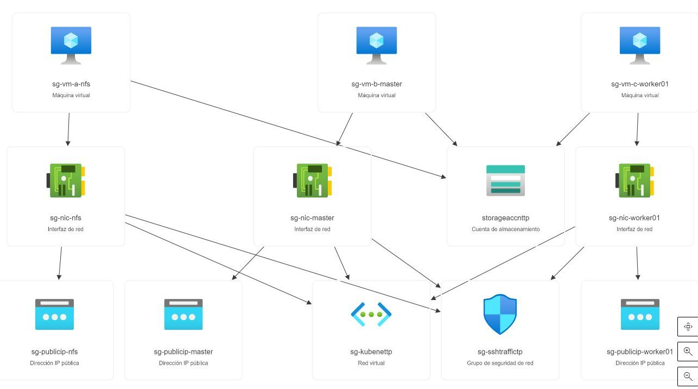
</p>


Todos los códigos a utilizar están disponibles en su última versión en https://github.com/silviaalejandra/tp2_devops
El repositorio cuenta con la siguiente informacion y ejecutables (Se muestran solo los necesarios para la ejecución de este instructivo de instalación)

```
tp2_devops
├── ansible
│   ├── hosts
│   ├── deploy.sh
│   ├── group_vars
│   │   └── v_host.yaml
├── requisitos.sh
├── startdeploy.sh
└── terraform
    ├── correccion-vars.tf
    ├── credentials.tf
```

**/ansible/hosts**

Contiene las entradas de los host que se estarán creado durante el proceso definidas por nombre. Una vez finalizada la aplicación de los pre requisitos sobre el entorno local es necesario actualizar el valor de la propiedad *ansible_user* con el usuario de servicio proporcionado

```
ansible_user=<usuario servicio creado>
```

**/ansible/deploy.sh**

Si bien todo el proceso de creacion de infraestructura e instalacion de la aplicación lo estaremos realizando con el fichero principal, es posible ejecutar la instalacion de Kubernetes y de AgoCD solo ejecutando desploy.sh.
>IMPORTANTE: El uso de este fichero implica que la plataforma ya se encuentra disponible y generado el archivo /ansible/group_vars/v_host.yaml con las IPs publicas de las VM de Azure

**/terraform/correccion-vars.tf**

Contiene las variables principales de la ejecucion de Terraform para la creacion de la infraestructura. Una vez finalizada la aplicación de los pre requisitos sobre el entorno local es necesario actualizar el valor de la variable *ssh_user* con el usuario de servicio proporcionado en la propiedad *default*.

```
variable "ssh_user" {
	type = string
	description = "Usuario para hacer ssh"
	default = "<SSH USER>"
}
```

**/terraform/credentials.tf**

Contiene los valores necesarios para la conectividad con Azure. Se debe actualizar para poder inicial el proceso.

```
provider "azurerm" {
features {}
subscription_id = "<SUBSCRIPTION_ID>"
client_id = "<APP_ID>"  # se obtiene al crear el service principal
client_secret = "<CLIENT_SECRET>"  # se obtiene al crear el service principal
tenant_id = "<TENANT_ID>"  # se obtiene al crear el service principal
}
```

**/requisitos.sh**

Con este fichero estaremos instalando las herramientas necesarias en el entorno local de trabajo para el uso de Terraform y Ansible.

**/startdeploy.sh**

Este es el fichero principal de ejecucion. El mismo recibe dos opciones
* **OpcionInfra** admite los valores **A** para Aplicar (crear) la infraestructura en Azure,  **D** para destruir la plataforma generada en Azure, o **S** para saltar este paso y ejecutarlo en otro momento. 
	>IMPORTANTE: La destruccion de la infraestructura solo es posible si la misma fue creada con Terraform.


	>NOTA: La opción S se puede utilizar para ejecutar solo la implementacion de Kubernetes y ArgoCD teniendo disponible ya la infraestructura en Azure.

* **OpcionKube** admite los valores **A** para intalar Kubernetes y ArgoCD con Ansible, o **S** para saltar el paso de instalación y realizarlo en otro momento. 

```
/startdeploy.sh <OpcionInfra> <OpcionKube>
```

<p align="center">
  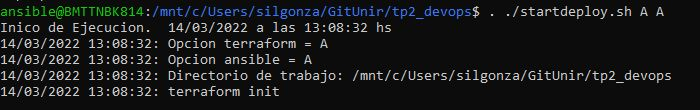
</p>

## Licencias 
Las licencias utilizadas por las aplicaciones que estaremos trabajando pueden encontrarse en los siguientes ficheros. El uso de estos productos implica la aceptación de las mismas.
* Terraform: fichero /terraform/LICENSE. **Mozilla Public License**
* Ansible: fichero /ansible/LICENSE. **GNU GENERAL PUBLIC LICENSE**
* ArgoCD: fichero/LICENSE. **Apache License** 

```
tp2_devops
├── ansible
│   ├── LICENSE
├── LICENSE
└── terraform
 │   ├── LICENSE
```

# Requisitos y restricciones
Se entiende como **entorno de trabajo** al equipo desde el cual se ejecutarán todos los ficheros que componen la instalación descripta
Se entiende como **entorno cloud** a la suscripción de Azure que debe estar diponible para la instalación.

## Entorno de trabajo
Se detallan a continuacion las características del equipo entorno de trabajo desde el cual se lanzarán las ejecuciones.
SO Ubuntu 20.04.3 LTS (GNU/Linux 5.10.16.3-microsoft-standard-WSL2 x86_64)
El mismo puede ser generado en cualquier PC con windows siguiendo los pasos de la [página oficial de Microsoft](https://docs.microsoft.com/en-us/windows/wsl/install)

**1 - Iniciar sesion en el entorno de trabajo seleccionando la aplicacion "Ubuntu" desde el menú Inicio de Windows.** 
> El usuario con el cual se accede tiene la posibilidad de hacer sudo con la contraseña seteada en los pasos de creacion.

<p align="center">
  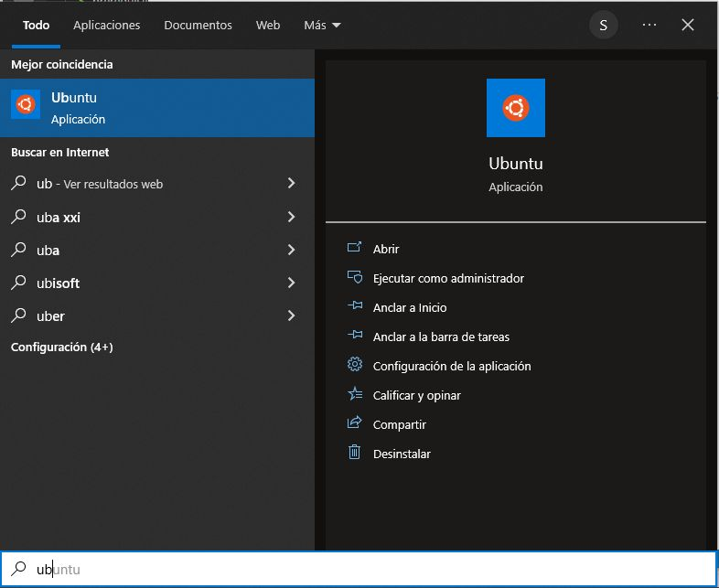
</p>

**2 - Ejecutar el siguiente comando para actualizar los paquetes del equipo. Esto nos permitirá además realizar otras instalaciones previas de herramientas.**

```
$ sudo apt update
```

<p align="center">
  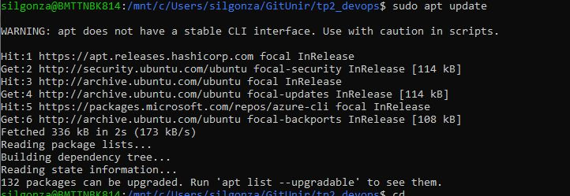
</p>

**3- Instalar git para clonar el repositorio con los archivos a ejecutar.**

```
$ sudo apt install git
```

<p align="center">
  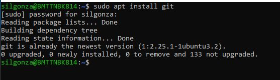
</p>

**4 - Clonar el repositorio de trabajo y posicionarse en el directorio de trabajo**

```
$ git clone https://github.com/silviaalejandra/tp2_devops.git
$ cd tp2_devops
$ ls -al
```

<p align="center">
  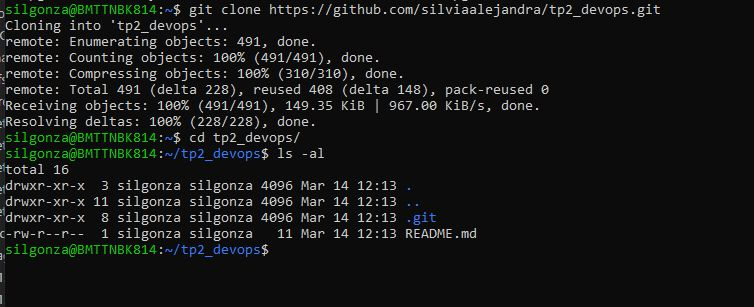
</p>

**5 - Ejecutar el fichero requisitos.sh. Se requieren un parámetros de entrada.**

*  **userServicio** es el nombre de usuario de servicio. Resguardar esta opcion seleccionada ya que será utilizada para completar los archivos /terraform/correccion-vars.tf y /ansible/hosts.

	>IMPORTANTE: La ejecución de este fichero solicitará la contraseña del usuario logueado en el entorno de trabajo para ejecutar comandos con sudo

	Esta ejecucion nos permitirá incluir en el entorno de trabajo los siguientes requisitos:
	* Ansible
	* Crony
	* jq
	* Terraform
	* python3
	* openssh-server

```
$ sudo sh requisitos.sh <userServicio>
```

<p align="center">
  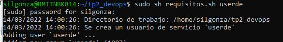
</p>

**6 - Finalizada la instalacion debemos ingresar con el usuario creado.**
La contraseña será el mismo nombre de usuario. Allí crearemos una llave ssh para conectarnos con las VM de Azure. Esta llave la colocaremos en un directorio dentro de /terraform/.ssh para su uso por las VM.

```
$ su <userServicio>
$ cd $HOME
$ ssh-keygen -t rsa -b 4096
$ sudo cp ~/.ssh/id_rsa $HOME/<userServicio>/tp2_devops/terraform/.ssh/id_rsa
$ sudo cp ~/.ssh/id_rsa.pub $HOME/<userServicio>/tp2_devops/terraform/.ssh/id_rsa.pub
```
<p align="center">
  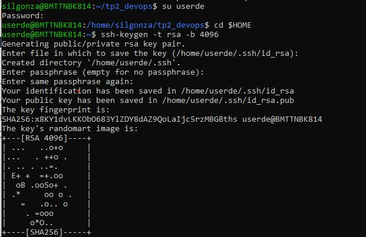
  <br>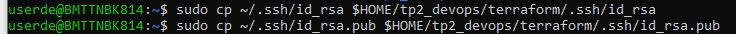</br>
</p>

**07 - Actualizamos archivos de configuracion necesarios para el funcionamiento de Ansible y Terraform**
	07.1 - Abrir el fichero $HOME/tp2_devops/ansible/hosts y actualizar el parametro *ansible_user*
<p align="center">
  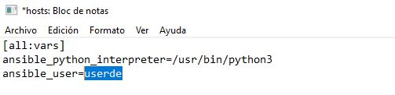
</p>
	07.2 - Abrir el fichero $HOME/tp2_devops/terraform/correccion-vars.tf y actualizar el parametro *ssh_user* con el usuario de servicio proporcionado en la propiedad *default*.
<p align="center">
  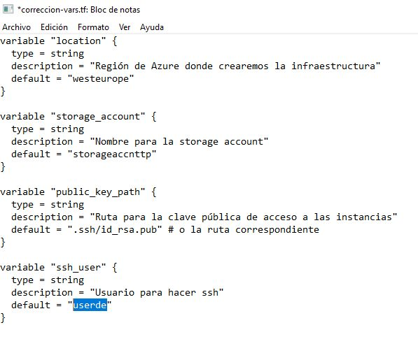
</p>

## Entorno cloud
Se detallan a continuacion los requisitos y restricciones del uso de un entorno Azure con licencia limitada o gratuita

El objetivo final de este despliegue de infraestructura será de 3 VMs  con su respectiva configuraciond e red para poder accederlas e instalar Kubernetes.
>IMPORTANTE: Para el despliegue de un cluster, los requistos deseables son los siguientes
>
>| Role | vCPUs | Memoria (GiB) | Disco Duro |
>|------|-------------------|-------|---------------|------------|
>| NFS | 2 | 4 | 1 x 20 GiB (boot) |
>| Master | 2 | 8 | 1 x 20 GiB (boot) |
>| Worker | 2 | 4 | 1 x 20 GiB (boot) |
>| Worker | 2 | 4 | 1 x 20 GiB (boot) |
>
>Por restricciones de la cuenta no es posible utilizar más de 7 vCPUs con lo cual se creará un cluster con solo un nodo Worker, ya que Kubeadm no corre en menos de 2 vCPU

**01 - Obtener id de suscripcion y crear un service principal**
	Ingresar a la cuenta de Azure y navegar hasta la opcion *Suscripcion*. Tomar el valor *Id. de la suscripcion*

<p align="center">
  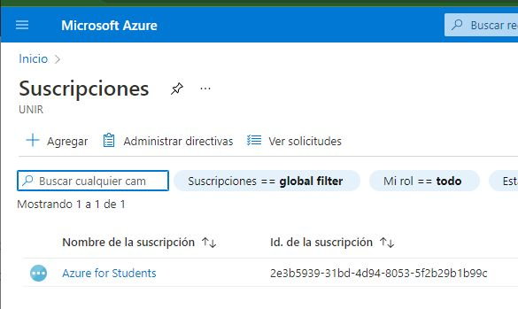
</p>

Instalar en el entorno de trabajo el cliente Azure Cli de acuerdo a las [instrucciones del proveedor Microsoft](https://docs.microsoft.com/en-us/cli/azure/install-azure-cli)
	
Ingrear a PowerShell y ejecutar a creacion de un service principal. Este service será una especie de usuario de servicio dentro del entorno cloud

```
PS > az login
PS > az account set --subscription=<SUBSCRIPTION_ID>
PS > az ad sp create-for-rbac --role="Contributor"
```

El resultado será similar al siguiente (se protegen datos de la suscripcion de ejemplo)

```
az : WARNING: The underlying Active Directory Graph API will be replaced by Microsoft Graph API in a future version of Azure CLI. Please carefully review 
all breaking changes introduced during this migration: https://docs.microsoft.com/cli/azure/microsoft-graph-migration
En línea: 1 Carácter: 1
+ az ad sp create-for-rbac --role="Contributor"
+ ~~~~~~~~~~~~~~~~~~~~~~~~~~~~~~~~~~~~~~~~~~~~~
    + CategoryInfo          : NotSpecified: (WARNING: The un...graph-migration:String) [], RemoteException
    + FullyQualifiedErrorId : NativeCommandError
 
WARNING: Starting from Azure CLI 2.35.0, --scopes argument will become required for creating role assignments. Please explicitly specify --scopes.
WARNING: Creating 'Contributor' role assignment under scope '/subscriptions/2e3b5939-31bd-4d94-8053-5f2b29b1b99c'
WARNING: The output includes credentials that you must protect. Be sure that you do not include these credentials in your code or check the credentials 
into your source control. For more information, see https://aka.ms/azadsp-cli
{
  "appId": "ab23ce50-de19-4394-8db8-2549f3280f9d",
  "displayName": "azure-cli-2022-03-09-02-14-24",
  "password": "***********************",
  "tenant": "899789dc-202f-44b4-8472-a6d40f9eb440"
}
```

**02 - Completar las variables de acceso al entonro Azure /terraform/credentials.tf con los valores de la suscripción y del service principal obtenido en el paso anterior**

```
provider "azurerm" {
features {}
subscription_id = "<SUBSCRIPTION_ID>"
client_id = "<APP_ID>"  # se obtiene al crear el service principal
client_secret = "<CLIENT_SECRET>"  # se obtiene al crear el service principal
tenant_id = "<TENANT_ID>"  # se obtiene al crear el service principal
}
```

**03 - Aceptar el uso de la imágen**
Para la implenetacion se ha decidido utilizar vms de Azure con una imágen de CentOS 8.
Esta imágen la provee Azure, con lo cual debemos aceptar los terminos de us uso.
Para ello ejecutamos en PoweShell

```
PS > az vm image terms show --urn cognosys:centos-8-stream-free:centos-8-stream-free:1.2019.0810
PS > az vm image terms accept --urn cognosys:centos-8-stream-free:centos-8-stream-free:1.2019.0810
```

Tendremos una salida como la siguiente

```
PS > az vm image terms show --urn cognosys:centos-8-stream-free:centos-8-stream-free:1.2019.0810
{
  "accepted": false,
  "id": "/subscriptions/************/providers/Microsoft.MarketplaceOrdering/offerTypes/VirtualMachine/publishers/cognosys/offers/centos-
8-stream-free/plans/centos-8-stream-free/agreements/current",
  "licenseTextLink": "https://mpcprodsa.blob.core.windows.net/legalterms/3E5ED_legalterms_COGNOSYS%253a24CENTOS%253a2D8%253a2DSTREAM%253a2DFREE%253a24CENTOS%253a
2D8%253a2DSTREAM%253a2DFREE%253a24CCYSNQWELVORSIA5MDTVHE6FPIZ5GCO3T6OUM53IUP4XFKJY2B4QTN6L43QJMNSF7SRMTP24UPT5LWRG35IQ7SJVHFMLGFEXMXKVQGI.txt",
  "marketplaceTermsLink": "https://mpcprodsa.blob.core.windows.net/marketplaceterms/3EDEF_marketplaceterms_VIRTUALMACHINE%253a24AAK2OAIZEAWW5H4MSP5KSTVB6NDKKRTUB
AU23BRFTWN4YC2MQLJUB5ZEYUOUJBVF3YK34CIVPZL2HWYASPGDUY5O2FWEGRBYOXWZE5Y.txt",
  "name": "centos-8-stream-free",
  "plan": "centos-8-stream-free",
  "privacyPolicyLink": "http://www.cogno-sys.com/cognosys-technologies-partners/privacy-policy/",
  "product": "centos-8-stream-free",
  "publisher": "cognosys",
  "retrieveDatetime": "2022-03-09T19:20:59.1335954Z",
  "signature": "J2D6EPBV73ZCLDWSUFP73VI56XPMZAJNY7NB6SZVDFC4S5MYCR5PBLF2TWRRQNGD4QVDQJNXD53A4QEQLETVXOBTSGDHAWAQW3ZXQLA",
  "systemData": {
    "createdAt": "2022-03-09T19:20:59.208544+00:00",
    "createdBy": "2e3b5939-31bd-4d94-8053-5f2b29b1b99c",
    "createdByType": "ManagedIdentity",
    "lastModifiedAt": "2022-03-09T19:20:59.208544+00:00",
    "lastModifiedBy": "2e3b5939-31bd-4d94-8053-5f2b29b1b99c",
    "lastModifiedByType": "ManagedIdentity"
  },
  "type": "Microsoft.MarketplaceOrdering/offertypes"
}

PS > az vm image terms accept --urn cognosys:centos-8-stream-free:centos-8-stream-free:1.2019.0810
{
  "accepted": true,
  "id": "/subscriptions/*************************/providers/Microsoft.MarketplaceOrdering/offerTypes/Microsoft.MarketplaceOrdering/offertypes/publishe
rs/cognosys/offers/centos-8-stream-free/plans/centos-8-stream-free/agreements/current",
  "licenseTextLink": "https://mpcprodsa.blob.core.windows.net/legalterms/3E5ED_legalterms_COGNOSYS%253a24CENTOS%253a2D8%253a2DSTREAM%253a2DFREE%253a24CENTOS%253a
2D8%253a2DSTREAM%253a2DFREE%253a24CCYSNQWELVORSIA5MDTVHE6FPIZ5GCO3T6OUM53IUP4XFKJY2B4QTN6L43QJMNSF7SRMTP24UPT5LWRG35IQ7SJVHFMLGFEXMXKVQGI.txt",
  "marketplaceTermsLink": "https://mpcprodsa.blob.core.windows.net/marketplaceterms/3EDEF_marketplaceterms_VIRTUALMACHINE%253a24AAK2OAIZEAWW5H4MSP5KSTVB6NDKKRTUB
AU23BRFTWN4YC2MQLJUB5ZEYUOUJBVF3YK34CIVPZL2HWYASPGDUY5O2FWEGRBYOXWZE5Y.txt",
  "name": "centos-8-stream-free",
  "plan": "centos-8-stream-free",
  "privacyPolicyLink": "http://www.cogno-sys.com/cognosys-technologies-partners/privacy-policy/",
  "product": "centos-8-stream-free",
  "publisher": "cognosys",
  "retrieveDatetime": "2022-03-09T19:22:56.7866237Z",
  "signature": "OEQFNTTJDQBKUZYBXTJKOOSN5MBK3JLUFKCRCNKDSFYZDCPRHEF5ZN7YYRJ7JOELSL6HV26DWKYNJPCPB3BQ2RPWF6VPBHPLUFONINQ",
  "systemData": {
    "createdAt": "2022-03-09T19:22:57.713446+00:00",
    "createdBy": "2e3b5939-31bd-4d94-8053-5f2b29b1b99c",
    "createdByType": "ManagedIdentity",
    "lastModifiedAt": "2022-03-09T19:22:57.713446+00:00",
    "lastModifiedBy": "2e3b5939-31bd-4d94-8053-5f2b29b1b99c",
    "lastModifiedByType": "ManagedIdentity"
  },
  "type": "Microsoft.MarketplaceOrdering/offertypes"
}
```

## Creacion de Infraestructura e instalacion de Kubernetes

Para la instalacion ejecutaremos el fichero /startdeply.sh con los parametros A A lo cual nos permite aplicar tanto la creacion de la infraestructura como la instalacion de Kubernetes a continuación
>IMPORTANTE: Debemos ejecutar todos los pasos siguientes con el usuario de servicio creado en los pasos anteriores

```
$ . ./ startdeploy.sh A A
```

<p align="center">
  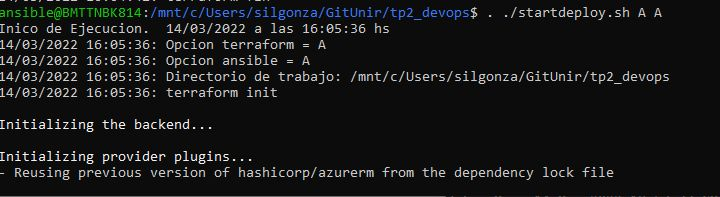
</p>

El script trabaja de la siguiente forma:

**01- Alta de infraestructura en Azure**
Para esto se ejecutan los ficheros dentro del directorio /terraform que definen las directivas de creacion de cada servicio en Azure.
El resultado se podrá visualizar en la consola de la suscripción de Azure. 

<p align="center">
  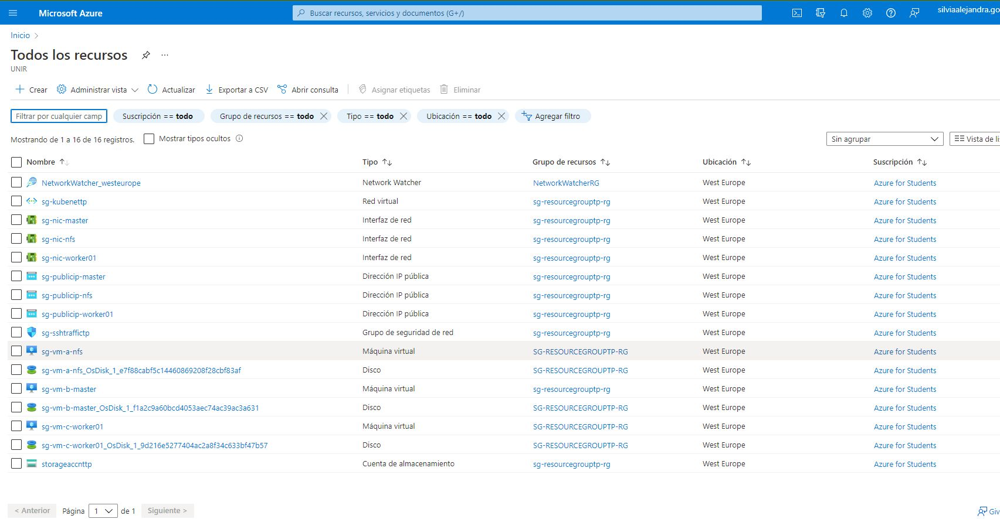
</p>

Al finalizar nos arroja por pantalla la lista de IPs y nombres de las vms creadas. A su vez genera un archivo en /ansible/group_vars/v_host.yaml con las IPs publicas de las VM para poder actualizar los ficheros /etc/hosts de las maquinas involucradas en la instalacion. Estas son las vm de Azure y el entorno de trabajo.
Si todo se completa de forma correcta, se muestra una salida de prueba de conectividad de Ansible con los nodos de trabajo, debiendo estar en *SUCCESS* todas las conexiones.

<p align="center">
  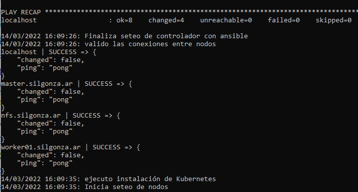
</p>

Los datos se obtienen consultando a las salidas disponibles de la ejecucion de terraform configuradas en /terraform/output.tf

**02 - Actualizacion del entorno de trabajo**
En este paso actualiza el hosts del entorno de trabajo con las ips de las nuevas vm de Azure.
A su vez sincroniza el tiempo del equipo e instala el cliente de argocd.
Para ello utiliza un playbook de ansible que ejecuta el rol init_controller para los nodos definidos en /ansible/hosts bajo el grupo [controller]

>NOTA: Esto se puede ejecutar desde /ansible/controller.sh Por defecto se ejecuta con /statdeploy.sh.

**03 - Actualizacion de las máquinas involucradas**
En este paso actualiza los paquetes de instalacion de los equipos para los sistemas operativos correspondientes y el archivo /etc/hosts de cada equipo. 
Esto ejecuta un playbook de ansible para los nodos definidos en /ansible/hosts bajo el grupo [updatepaqs]
>NOTA: Esto se puede ejecutar desde /ansible/deploy.sh, lo cual Instala Kubernetes y Argocd, o desde /ansible/prerequisites.sh Por defecto se ejecuta con /statdeploy.sh.

**05 - Preparación del equipo NFS**
Se completan las tareas de preparacion de la vm que funcionará como nodo nfs en el cluster de Kubernetes.
Se instalan las herramientas:
* nfs-utils
* net-tools
y se habilitan en firewall los servicios
* nfs
* rpc-bind
* mountd

>NOTA: Esto se puede ejecutar desde /ansible/deploy.sh, lo cual Instala Kubernetes y ArgoCD o desde /ansible/nfs.sh Por defecto se ejecuta con /statdeploy.sh.

**06 - Preparación del equipo master**
Se completan las tareas de preparacion de la vm que funcionará como nodo master en el cluster de Kubernetes.
Se instalan las herramientas para levantar el cluster
* Docker
* Kubeadm
* Kubelet
* Kubectl

>NOTA: Esto se puede ejecutar desde /ansible/deploy.sh, lo cual Instala Kubernetes y Argocd, o desde /ansible/master.sh Por defecto se ejecuta con /statdeploy.sh.

La preparacion se divide en distintos roles de Ansible para su ejecucion
* init_k8snodes
	contienen todas las intalaciones necesarias para Kubernetes y configuraciones de network que se comparte en cualquier tipo de nodo (master o worker)
* role: init_master
Completa la instalacion del nodo master configurando el SDN y creando las llaves de comunicacion entre el master y los nodos.

La preparacion se divide en distintos roles de Ansible para su ejecucion
* init_k8snodes
	contienen todas las intalaciones necesarias para Kubernetes y configuraciones de network que se comparte en cualquier tipo de nodo (master o worker)
* role: init_master
Completa la instalacion del nodo master configurando el SDN y creando las llaves de comunicacion entre el master y los nodos.
A su vez se installa un ingress del tipo [haproxy](https://www.haproxy.com/documentation/kubernetes/latest/) para el despliegue de aplicaciones y el acceso desde el esterior.

**07 - Preparación del equipo worker**
Se completan las tareas de preparacion de la vm que funcionará como nodo worker en el cluster de Kubernetes.
Se instalan las herramientas para levantar el cluster
* Docker
* Kubeadm
* Kubelet
* Kubectl

>NOTA: Esto se puede ejecutar desde /ansible/deploy.sh, lo cual Instala Kubernetes y Argocd, o desde /ansible/workers.sh Por defecto se ejecuta con /statdeploy.sh.

La preparacion se divide en distintos roles de Ansible para su ejecucion
* init_k8snodes
	contienen todas las intalaciones necesarias para Kubernetes y configuraciones de network que se comparte en cualquier tipo de nodo (master o worker)
* role: init_worker
Se centra en la sincronizacion del nodo worker con el master

## Instalacion de ArgoCD
[ArgoCD](https://argo-cd.readthedocs.io/en/stable/) es una herramienta de despliegue continuo que funciona de forma declarativa. Se puede instalar en un clúster de Kubernetes y puede desplegar aplicaciones en el mismo clúster o en otros clústers, permitiendo así gestionar de forma centralizada y automática el despliegue de software.

<p align="center">
  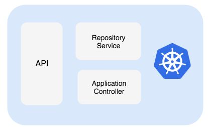
</p>

>NOTA: Esto se puede ejecutar desde /ansible/deploy.sh, lo cual Instala Kubernetes y Argocd, o desde /ansible/app_argocd.sh. Por defecto se ejecuta con /statdeploy.sh.

Para la instalacion los archivos yaml de deply se encuentran en /ansible/roles/argocd/files

01 - Datos de configuración
Una vez finalizada la instalacion es necesario obtener algunos valores dentro del cluster de Kubernetes
Para ello nos logueamos al equipo master con el usuario de servicio

```
$ ssh <userServicio>@master
``` 

Allí ejecutamos los siguientes comandos que nos poermiten obtener informacion de nuestro cluster. Debemos obtener el puerto por el cual redirecciones el ingress

```
```

Y debemos obtener la contraseña del usuario administrador de ArgoCD que se genera por defecto con un hash en la instalación.

```
kubectl -n argocd get secret argocd-initial-admin-secret -o jsonpath="{.data.password}"  | base64 -d;  echo
```

Para cambiarla debemos ejecutar

```
argocd account update-password
```

**02 - Login por consola**
Ejecutamos fuera del cluster lo siguiente. Para ello debemos contar con la IP Publica del nodo master y el puerto donde expone el ingress controller

```
$ argocd login --insecure master:xxxx
```
Obtendremos un prompt para ingresar usuario y contraseña. El primer ingreso será con el hash obtendo en el paso anterior.


Al momento de la entrega no se ha podido levantar la UI del aplicativo ArgoCD.
La definición de Ingress para utilizar el Ingress Controller de Haproxy no está siendo la correcta y no se ha podido avanzar. Se está siguendo la documentacion oficial de Haproxy para los flags https://www.haproxy.com/documentation/kubernetes/latest/configuration/ingress/ y de ArgoCD https://argo-cd.readthedocs.io/en/stable/operator-manual/ingress/ para la configuración

<p align="center">
  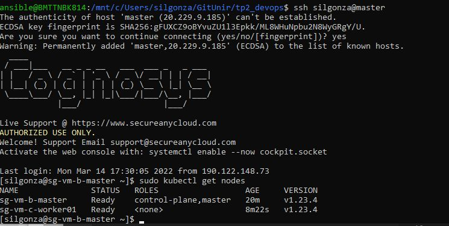
  <br>
   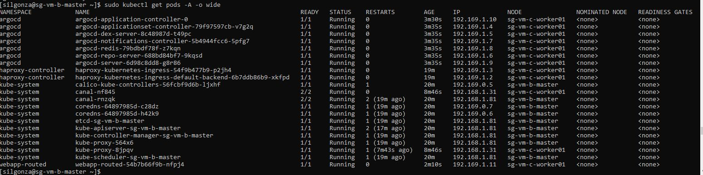
   <br>
   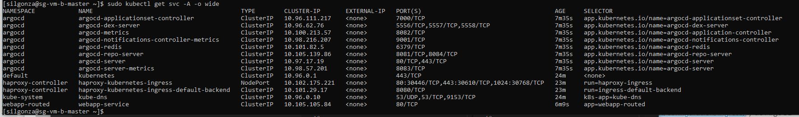
   <br>
   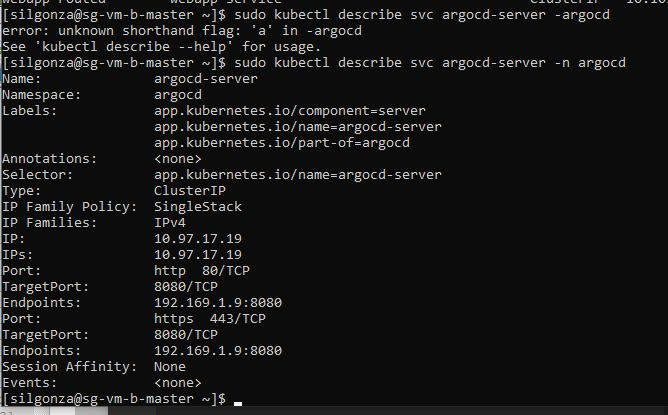
   <br>
   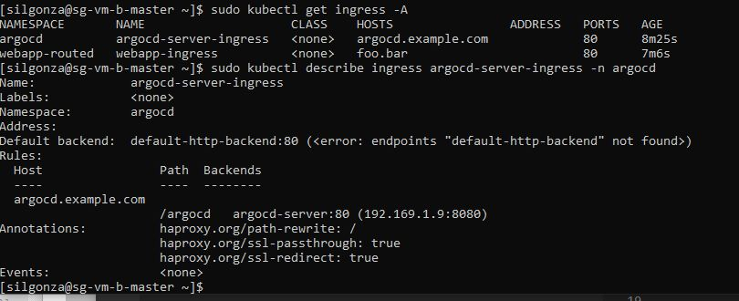
</p>

## Notas del proceso TP 02
* Se han encontado algunos incovenientes con la instalacion de la extension ansible-galaxy collection kubernetes.core.k8s lo cual nos permitía ejecutar comandos kubectl desde Ansible.
Luego de instalada no se encontraban los ficheros de la extensión.
Por ello se puede observar que se resuelven gran parte de los comandos con la directiva *command*

* No fue posible realizar reload del firewall con *systemd*. No se impactaban los cambios. Se tomó la decision de realizarlo como *command*